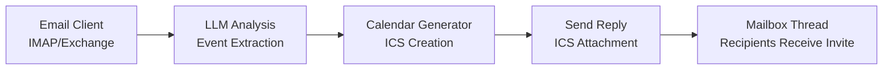

# iCal Bot - Automated Email to Calendar System

An intelligent bot that monitors your email inbox, uses a local LLM to detect event descriptions, and automatically creates and sends calendar invites (.ics files) as replies.

## Features

- 📧 **Email Integration**: Connects to your email via IMAP/SMTP
- 🤖 **AI-Powered Event Detection**: Uses a local LLM (Ollama) to identify events in email content
- 📅 **Calendar Invite Generation**: Creates standard iCalendar (.ics) files
- ↩️ **Automatic Replies**: Sends calendar invites as threaded replies so all recipients benefit
- 📊 **Dashboard & Approvals**: Monitor detections, inspect raw LLM responses, and approve invites before they are sent
- 🗃️ **Persistent Audit Log**: SQLite-backed history of every processed email (events and non-events) with filtering
- 🔄 **Continuous Monitoring**: Runs in the background checking for new emails
- 💾 **Deduplication**: Tracks processed emails to avoid duplicates

## Prerequisites

1. **Python 3.8+**
2. **Ollama** - A local LLM server
   - Install from: https://ollama.ai/
   - Pull a model: `ollama pull gpt-oss:20b` (or any other model)
3. **Email Account** with IMAP/SMTP access
   - For Gmail: Enable "App Passwords" in your Google Account settings
   - For other providers: Check their IMAP/SMTP documentation

## Installation

1. **Clone or download this repository**

2. **Install Python dependencies** (pyproject-based):
   ```bash
   pip install -e .
   ```

3. **Set up Ollama** (if not already installed):
   ```bash
   # Install Ollama
   curl -fsSL https://ollama.ai/install.sh | sh
   
   # Pull a model (e.g., llama3.2)
   ollama pull llama3.2
   
   # Start Ollama server (runs on http://localhost:11434 by default)
   ollama serve
   ```

## Configuration

### Option 1: Environment Variables (Recommended)

Create a `.env` file in the project directory:

```bash
# Email Configuration
EMAIL_ADDRESS=your-email@gmail.com
# EMAIL_PASSWORD=your-app-password  # Optional if you enter it via the Web UI

# Gmail IMAP/SMTP (default)
IMAP_SERVER=imap.gmail.com
IMAP_PORT=993
SMTP_SERVER=smtp.gmail.com
SMTP_PORT=587

# LLM Configuration
LLM_ENDPOINT=http://localhost:11434/api/generate
LLM_MODEL=llama3.2
LLM_MAX_EVENTS_PER_EMAIL=5  # Keep top N event candidates per email
ATTACHMENT_PARSING_ENABLED=true
ATTACHMENT_MAX_FILES_PER_EMAIL=5
ATTACHMENT_MAX_FILE_SIZE_BYTES=5242880
ATTACHMENT_MAX_TEXT_CHARS=12000
ATTACHMENT_MAX_PDF_PAGES=20

# Optional Settings
CHECK_INTERVAL_SECONDS=300
MAX_EMAILS_PER_CHECK=10
DEFAULT_TIMEZONE=Europe/Berlin
ORGANIZER_NAME=iCal Bot
ORGANIZER_EMAIL=${EMAIL_ADDRESS}   # Sender identity for the organizer field in ICS; keep internal
INTERNAL_EMAIL_DOMAIN=example.com  # Optional internal domain used for organizer fallback and UI auto-deselect
RESULTS_DB_PATH=data/processed_results.db
AUTO_APPROVE_EVENTS=false  # Set to true to skip UI approval
ENABLE_DEBUG_DUMPS=false   # Set true to persist outbound .eml and LLM debug artifacts
LLM_DEBUG_DIR=             # Path for LLM debug dumps (ignored unless ENABLE_DEBUG_DUMPS=true)
REQUIRE_HTTPS_FOR_REMOTE=true
REQUIRE_HTTPS_FOR_LLM=true
```

### Option 2: Edit config.py directly

Alternatively, you can edit the default values in `config.py`.

### Gmail Setup

For Gmail users:
1. Go to Google Account settings → Security
2. Enable 2-Factor Authentication
3. Create an "App Password" for "Mail"
4. Use this app password in your configuration (not your regular password)

### Other Email Providers

Update the IMAP/SMTP settings for your provider:
- **Outlook**: imap-mail.outlook.com:993, smtp-mail.outlook.com:587
- **Yahoo**: imap.mail.yahoo.com:993, smtp.mail.yahoo.com:587
- **Custom**: Check your provider's documentation

## Usage

### Run Continuously (Recommended)

The bot will check your inbox every 5 minutes (configurable):

```bash
python main.py
```

Press `Ctrl+C` to stop.

### Run Once

Process current emails and exit:

```bash
python main.py --once
```

### Run Backend + Frontend Together

Start both the processing backend and the web dashboard from one command:

```bash
python run.py
```

- Backend (email processing) and frontend (Web UI) start together.
- Open `http://127.0.0.1:5000` in your browser.
- Use `python run.py --no-web` to run backend only.

### What Happens

1. Bot connects to your email inbox
2. Fetches new/unprocessed emails
3. For each email:
   - Sends email content to the local LLM
   - LLM analyzes if it contains event information
   - If event detected:
     - Creates a calendar invite (.ics file)
     - Sends a reply to the original email thread with the invite attached
     - All recipients in the thread receive the calendar invite
4. Tracks processed emails to avoid duplicates

### Web Dashboard & Approvals

Launch the dashboard (optional but recommended) in a separate terminal:

```bash
python web_ui.py
```

- Navigate to `http://127.0.0.1:5000` to see the live feed
- Click any record to inspect the full email body, LLM prompt/response, and ICS payload
- Required approvals (default) appear under the “Pending approvals” count and can be sent with a single click
- Set `AUTO_APPROVE_EVENTS=true` in `.env` if you prefer the bot to send invites immediately without UI approval
- Attachment text extraction is enabled by default and can be turned on/off in the dashboard via the “Attachments: ON/OFF” control

**Local UI authentication**
- On first run from localhost, open `/setup` to create your UI username and password.
- `/setup` is local-only; after setup, sign in via `/login`. Password managers can save this login.

**Mailbox credentials via UI**
- If EMAIL_PASSWORD is not set, the UI prompts you to enter the mailbox password once. It is kept in memory only.

**Prompt-injection warning**
- Entries flagged as potential prompt injection are marked in the UI; review those emails carefully.

**Data minimization**
- On startup the app censors sensitive fields and purges entries older than 1 month. Manual purge deletes entries older than 1 week.

**Custom local hostname (password manager-friendly):**
If your password manager ignores ports for localhost, map a custom hostname to 127.0.0.1 and use it in the browser.

Example (OS-agnostic):
1. Add a hosts entry for a local name (e.g., `icalbot.local`) pointing to `127.0.0.1` in your system hosts file.
2. Set `WEB_UI_HOST=icalbot.local` in `.env`.
3. Open `http://icalbot.local:5000`.

**Hosts file locations (by OS):**
- **Windows**: Edit as Administrator `C:\Windows\System32\drivers\etc\hosts` and add:
   `127.0.0.1  icalbot.local`
- **macOS**: Edit `/etc/hosts` and add:
   `127.0.0.1  icalbot.local`
- **Linux**: Edit `/etc/hosts` and add:
   `127.0.0.1  icalbot.local`

## How It Works

### Architecture



### Components

- **email_client.py**: Handles IMAP/SMTP connections and operations
- **llm_client.py**: Interfaces with Ollama to analyze email content
- **calendar_generator.py**: Creates iCalendar (.ics) files
- **main.py**: Orchestrates the entire workflow
- **config.py**: Configuration management

### Event Detection

The LLM analyzes emails for:
- Meeting requests
- Appointment scheduling
- Event announcements
- Time-specific activities

It extracts:
- Event title
- Date and time (handles relative dates like "next Monday")
- Duration (assumes 1 hour if not specified)
- Location (physical or virtual)
- Description

If multiple concrete event times are present in one email, the bot stores multiple event candidates (capped by `LLM_MAX_EVENTS_PER_EMAIL`) and requires manual selection in the UI before sending.

## Example

**Input Email**:
```
Subject: Team Meeting Next Week

Hey team,

Let's have our weekly sync next Monday at 2 PM. 
We'll meet in Conference Room B and discuss Q1 goals.

Duration: 1 hour

See you there!
```

**Bot Action**:
1. Detects event: "Team Meeting"
2. Extracts: Date (next Monday), Time (2 PM), Location (Conference Room B), Duration (1 hour)
3. Creates calendar invite
4. Replies to email with .ics attachment
5. All recipients can add to their calendars

## Troubleshooting

### LLM Connection Issues
```bash
# Check if Ollama is running
curl http://localhost:11434/api/tags

# Start Ollama if needed
ollama serve
```

### Email Authentication Errors
- Gmail: Ensure you're using an App Password, not your regular password
- Check IMAP/SMTP settings for your provider
- Verify 2FA is enabled (for Gmail)

### No Events Detected
- The LLM might need a better model (try `ollama pull llama3` for a larger model)
- Check the email content is clear about the event details
- Review logs for LLM responses

### Calendar Invites Not Sending
- Check SMTP configuration
- Verify email credentials
- Check logs for specific error messages

## Customization

### Change LLM Model
```bash
# Pull a different model
ollama pull mistral

# Update .env or config.py
LLM_MODEL=mistral
```

### Adjust Check Interval
```bash
# In .env or config.py
CHECK_INTERVAL_SECONDS=600  # 10 minutes
```

### Customize Reply Message
Tweak the `build_reply_message` helper in `messaging.py` to change disclaimers or formatting.

## Security Notes

- Never commit `.env` file or credentials to version control
- Never commit runtime files in `data/` (auth store/secret, SQLite DB, temp credentials)
- Use app-specific passwords, not your main email password
- Keep your LLM local to maintain privacy
- Attachment extraction is limited to bounded, text-safe formats (`.txt`, `.md`, `.csv`, `.log`, `.pdf`, `.docx`) and can be disabled in the UI

## Deployment (Docker + reverse proxy)

1. Copy `.env.example` to `.env` and set real values. Keep `ENABLE_DEBUG_DUMPS=false` in production.
2. Build and run via Docker Compose:
   ```bash
   docker compose build
   docker compose up -d
   ```
   The app listens on `app:5000`; the bundled nginx proxy forwards port 80 to the app. Add TLS by mounting certs and enabling the 443 block in `deploy/nginx.conf`.
3. Ollama access: when using Docker, point `LLM_ENDPOINT` to `http://host.docker.internal:11434` (compose already sets this) or to another reachable host/IP.
4. Auth: on first run, open `/setup` from localhost to create your UI login, then continue with `/login`.
5. File permissions: restrict `data/` and the SQLite DB to the service user; do not bake secrets into images.

## Limitations

- Requires emails to have clear event descriptions
- LLM accuracy depends on the model and email clarity
- Attachment extraction is best-effort and intentionally bounded by file size/page/character limits
- Timezone handling is basic (defaults to UTC)

## Future Enhancements

- Support for recurring events
- Better timezone detection
- Integration with calendar APIs (Google Calendar, Outlook)
- Web interface for monitoring
- Support for updating existing events

## License

GNU General Public License v3.0 (GPLv3). See `LICENSE`.

## Support

For issues or questions:
1. Check the logs for error messages
2. Verify your configuration settings
3. Test LLM connectivity separately
4. Ensure email credentials are correct

---

**Happy Scheduling! 📅**
